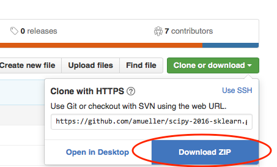

Introduction to Machine learning (with Andreas Mueller)
========================================================


Instructor
-----------

- [Andreas Mueller](http://amuller.github.io) [@amuellerml](https://twitter.com/amuellerml) - Columbia University; [Book: Introduction to Machine Learning with Python](http://shop.oreilly.com/product/0636920030515.do)

---

This repository will contain the teaching material and other info associated with the "Introduction to Machine Learning"
course.


Obtaining the Tutorial Material
--------------------------------


If you are familiar with git, it is probably most convenient if you clone the GitHub repository. This
is highly encouraged as it allows you to easily synchronize any changes to the material.

```
git clone https://github.com/amueller/ml-training-intro.git
```

If you are not familiar with git, you can download the repository as a .zip file by heading over to the GitHub repository (https://github.com/amueller/ml-training-intro) in your browser and click the green “Download” button in the upper right.



Please note that I may add and improve the material until shortly before the tutorial session, and we recommend you to update your copy of the materials one day before the tutorials. If you have an GitHub account and forked/cloned the repository via GitHub, you can sync your existing fork with via the following commands:

```
git pull origin master
```


Installation Notes
------------------

This tutorial will require recent installations of

- [NumPy](http://www.numpy.org)
- [SciPy](http://www.scipy.org)
- [matplotlib](http://matplotlib.org)
- [pillow](https://python-pillow.org)
- [scikit-learn](http://scikit-learn.org/stable/) (>=0.18.1)
- [IPython](http://ipython.readthedocs.org/en/stable/)
- [Jupyter Notebook](http://jupyter.org)

The last one is important, you should be able to type:

    jupyter notebook

in your terminal window and see the notebook panel load in your web browser.
Try opening and running a notebook from the material to see check that it works.

For users who do not yet have these  packages installed, a relatively
painless way to install all the requirements is to use a Python distribution
such as [Anaconda](https://www.continuum.io/downloads), which includes
the most relevant Python packages for science, math, engineering, and
data analysis; Anaconda can be downloaded and installed for free
including commercial use and redistribution.
The code examples in this tutorial should be compatible to Python 2.7,
Python 3.4, and Python 3.5, though we recommend using Python3.4 or higher.

After obtaining the material, we **strongly recommend** you to open and execute
a Jupyter Notebook `jupter notebook check_env.ipynb` that is located at the
top level of this repository. Inside the repository, you can open the notebook
by executing

```bash
jupyter notebook check_env.ipynb
```

inside this repository. Inside the Notebook, you can run the code cell by
clicking on the "Run Cells" button as illustrated in the figure below:


Finally, if your environment satisfies the requirements for the tutorials, the executed code cell will produce an output message as shown below:


